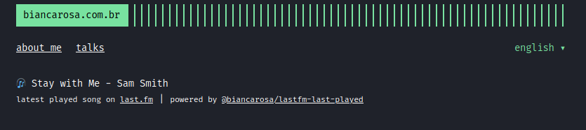

[](https://codecov.io/gh/biancarosa/lastfm-last-played)
# Last.fm Last Played Songs

# The Basics

## How it works

You can send a request to the API URL:

```bash
curl -s https://lastfm-last-played.biancarosa.com.br/{{your-lasfm-username}}/latest-song | jq
```

The query string `format` can receive the value `shields.io` for you to generate your own [Shields.io](https://shields.io/endpoint) markdown badge.

## Wanna use it?

### Markdown

[](https://github.com/biancarosa/lastfm-last-played)

```[](https://github.com/biancarosa/lastfm-last-played)```

### JavaScript

There aren't any frontend packages written *yet* because I am not a very strong frontend developer, so pull-requests are welcome, but I've written an example using basic JavaScript [here](https://github.com/biancarosa/lastfm-last-played/blob/master/examples/index.html).

On my [own website](https://biancarosa.com.br/), it looks like this:


Code is [here](https://github.com/biancarosa/blog/blob/master/layouts/partials/extended_header.html).

## Like it?

Consider starring the repo, contributing to it and tweeting about it.

# Running the app

## Docker

[Docker](https://www.docker.com/) and [Docker Compose](https://www.docker.com/) make things easy!

```sh
docker-compose up
# or if you want to run detached
docker-compose up -d
```

## Natively

### The API

There is a comprehensive `Makefile` in the project that can be used.

```sh
# install dependencies
make
# runs the app
make run
# other commands
make lint
make test
make integration-test
make coverage
```
